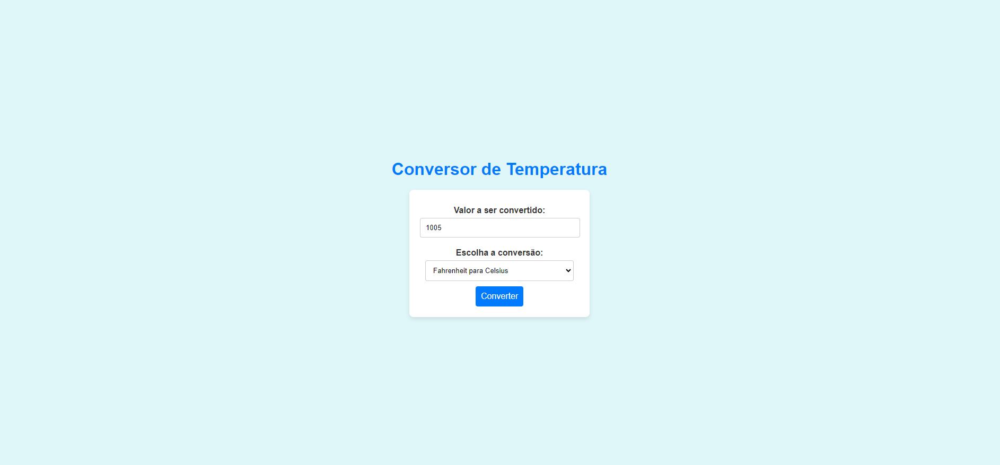

# Conversor de Temperatura

Este projeto é um conversor de temperatura que permite aos usuários converter valores entre Celsius e Fahrenheit. Ele foi desenvolvido usando Java e Java Servlet, e inclui testes automatizados utilizando Selenium.

## Funcionalidades

- **Conversão de Temperatura**: Converte valores entre Celsius e Fahrenheit.
- **Interface de Usuário**: Possui uma interface amigável onde o usuário pode inserir um valor e escolher a conversão desejada.
- **Testes Automatizados**: Utiliza Selenium para realizar testes automatizados, garantindo que a funcionalidade de conversão funcione corretamente.
  
## Tecnologias Utilizadas

- **Java**: Linguagem de programação utilizada para desenvolver o backend do aplicativo.
- **Jakarta Servlet**: Framework utilizado para criar a aplicação web.
- **Selenium**: Ferramenta de automação para realizar testes de interface do usuário.

## Imagens do projeto sendo executado

##### Tela inicial

#### Tela final

